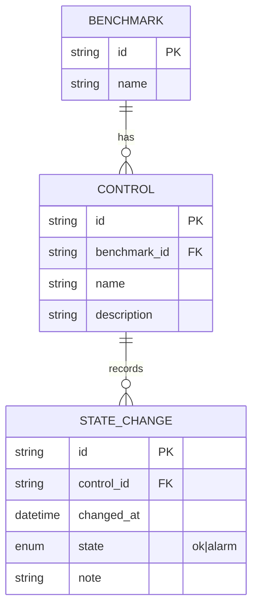

# Q1 — Benchmarks: estado atual e histórico (Conceitual + Índices) — **Sem DDL**

**Autor:** Michael Fernandes  
**Descrição:** Modelo conceitual (MER), índices propostos e exemplos de consultas para responder Q1, Q2 e Q3.  
**Observação:** Esta questão é **conceitual** — **não** há criação de tabelas (sem DDL).

---

## 1) Mini‑mundo → Modelo Conceitual (MER)

- **Benchmark** *(id, name)* tem vários **Controles**.  
- **Control** *(id, benchmark_id, name, description)* pertence a um **Benchmark** e possui um **estado**.  
- **StateChange** *(id, control_id, changed_at, state [ok|alarm], note?)* registra as **mudanças de estado** (histórico *append‑only*).

**Cardinalidades**
```
Benchmark (1) ────< (N) Control (1) ────< (N) StateChange
```

**MER (mermaid)**
> O GitHub renderiza automaticamente o diagrama abaixo.


**Observações**
- `state ∈ {ok, alarm}` (enum).  
- `changed_at` em **UTC** (timestamp com timezone) para consistência temporal.  
- O **estado atual** de um controle é o **último** registro em `STATE_CHANGE` (maior `changed_at`).  
- (Opcional) *Snapshot* para performance: **ControlCurrentState(control_id, state, changed_at)** com **1 linha por controle**, atualizada a cada mudança.

---

## 2) Índices (básicos) e justificativas

**CONTROL**
- `IDX_CONTROL_BENCHMARK (benchmark_id)` → acelera listar/relacionar controles de um benchmark.

**STATE_CHANGE**
- `IDX_SC_CONTROL_CHANGED_AT (control_id, changed_at)` → **principal** para:
  - recuperar **estado atual** (último por controle);
  - obter histórico **ordenado** por tempo por controle;
  - aplicar filtros por **intervalo** (`changed_at BETWEEN ...`) por controle.
- (Opcional) `IDX_SC_CHANGED_AT (changed_at)` → buscas **globais** por janela temporal.
- (Opcional) `IDX_SC_CONTROL_STATE_CHANGED_AT (control_id, state, changed_at)` → se houver consultas frequentes por estado específico.
- (Opcional — parcial) índice **parcial** em `WHERE state='alarm'` → se “alarmes” forem raros e muito consultados.

**ControlCurrentState** (se usar o snapshot)
- `PK/UNIQUE(control_id)` → *lookup* O(1) por controle.

> **Dica:** indices nas FKs (`CONTROL.benchmark_id`, `STATE_CHANGE.control_id`) evitam *table scans* em *joins* e melhoram integridade/remoção.

---

## 3) Consultas de exemplo (sem DDL)
Abaixo, **SELECTs ilustrativos** (estilo PostgreSQL) que mostram como o modelo atende cada cenário.

### (Q1) Listar Benchmark com seus Controles e o **estado atual**
**Sem snapshot** (pega a última mudança por controle):
```sql
SELECT b.id AS benchmark_id, b.name AS benchmark_name,
       c.id AS control_id, c.name AS control_name, c.description,
       sc.state AS current_state, sc.changed_at AS current_changed_at
FROM benchmark b
JOIN control c ON c.benchmark_id = b.id
LEFT JOIN LATERAL (
  SELECT state, changed_at
  FROM state_change
  WHERE control_id = c.id
  ORDER BY changed_at DESC
  LIMIT 1
) sc ON TRUE
WHERE b.id = :benchmark_id;
```
**Com snapshot (`ControlCurrentState`)**: substitua o `LATERAL` por `JOIN ControlCurrentState ccs ON ccs.control_id = c.id`.

### (Q2) Listar Benchmark com seus Controles e as **mudanças de estado em um intervalo**
```sql
SELECT b.id AS benchmark_id, b.name,
       c.id AS control_id, c.name AS control_name,
       sc.state, sc.changed_at
FROM benchmark b
JOIN control c ON c.benchmark_id = b.id
JOIN state_change sc ON sc.control_id = c.id
WHERE b.id = :benchmark_id
  AND sc.changed_at >= :from_ts
  AND sc.changed_at <  :to_ts
ORDER BY c.id, sc.changed_at;
```

### (Q3) Obter Benchmark com seus Controles e o **estado em uma data/hora X**
“Estado em X” = **último** `changed_at <= :at_ts` de cada controle.
```sql
SELECT b.id AS benchmark_id, b.name,
       c.id AS control_id, c.name AS control_name, c.description,
       sc_at_x.state, sc_at_x.changed_at
FROM benchmark b
JOIN control c ON c.benchmark_id = b.id
LEFT JOIN LATERAL (
  SELECT state, changed_at
  FROM state_change
  WHERE control_id = c.id
    AND changed_at <= :at_ts
  ORDER BY changed_at DESC
  LIMIT 1
) sc_at_x ON TRUE
WHERE b.id = :benchmark_id;
```

---

## 4) Como entregar esta questão no GitHub (passo a passo)
1. Crie um repositório público (ex.: `valcann-q1-benchmarks`).  
2. Adicione **este `README.md`** na raiz do repositório.  
3. `git init && git add README.md && git commit -m "Q1 Benchmarks: MER + índices + queries"`  
4. `git branch -M main`  
5. `git remote add origin https://github.com/<seu-usuario>/valcann-q1-benchmarks.git`  
6. `git push -u origin main`  
7. Envie a **URL pública** no e-mail de entrega.

**Título sugerido do e-mail geral da avaliação:**  
`VALCANN | Estágio Back-End | Avaliação Técnica | MICHAEL FERNANDES`

---

## 5) Extras (opcionais para se destacar)
- *Snapshot* `ControlCurrentState` para Q1 mais rápido.  
- **Particionamento** de `StateChange` por mês (grandes volumes), mantendo índice local `(control_id, changed_at)`.  
- **Índice parcial** `state='alarm'` (se raro e consultado com frequência).  
- **UTC sempre** em `changed_at` + auditoria com `note` (quem/porquê mudou).